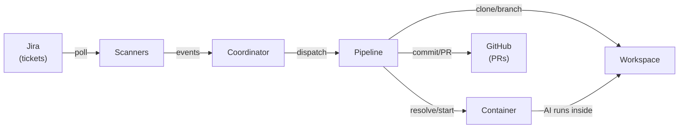
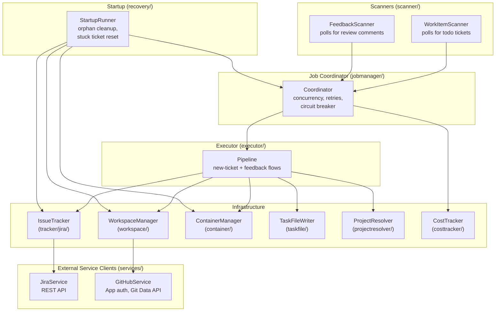
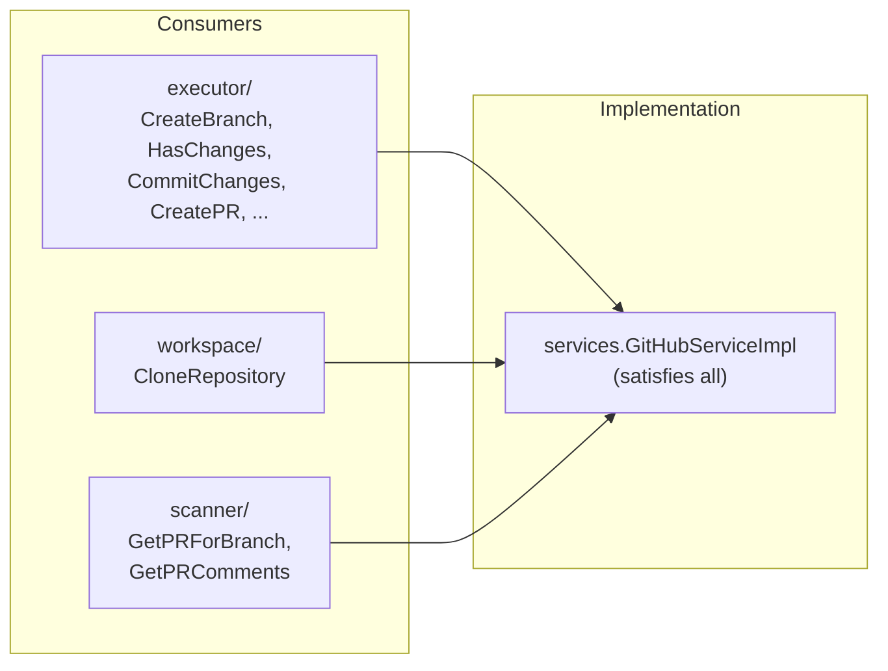
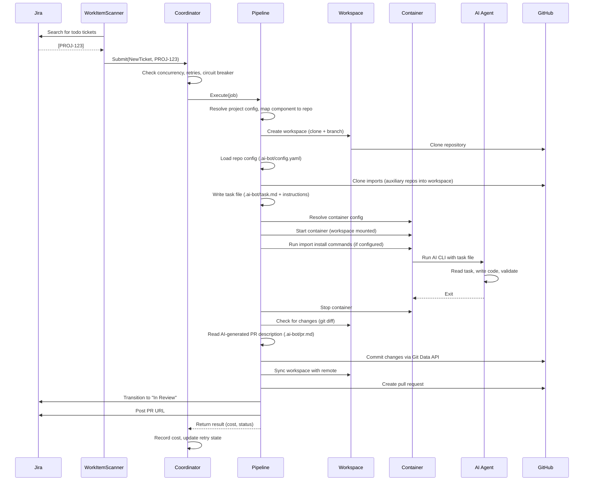
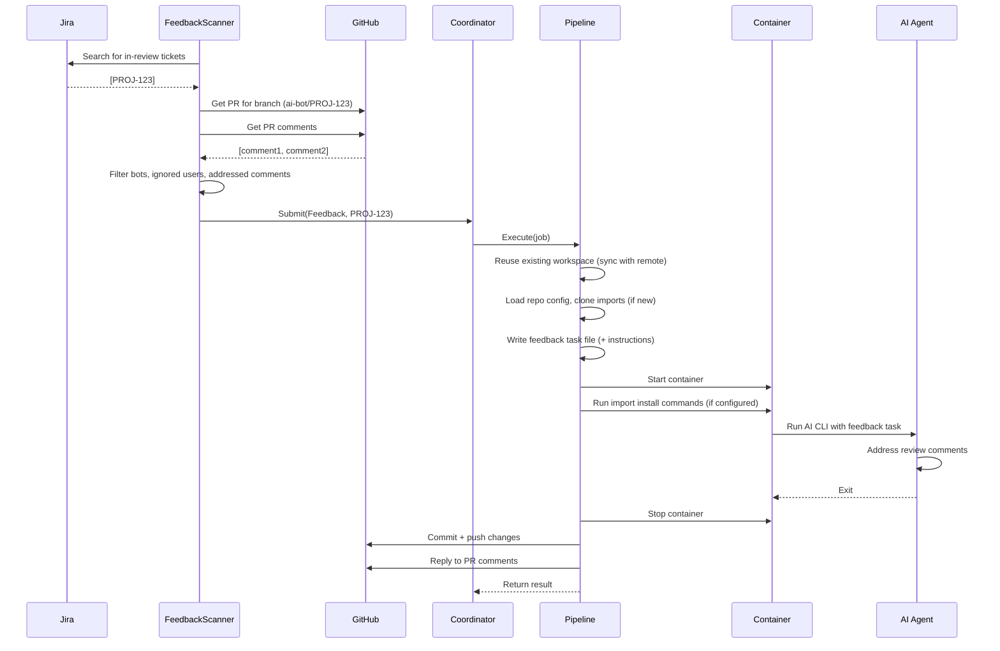
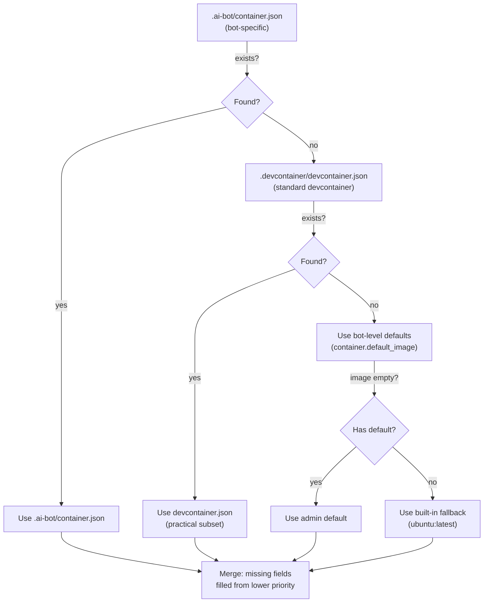
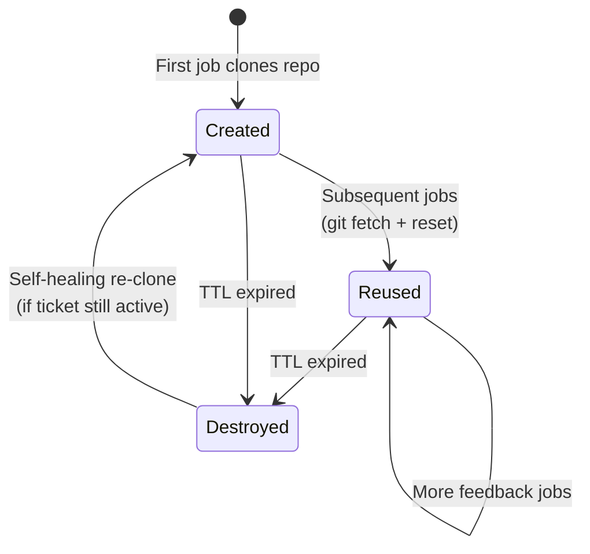
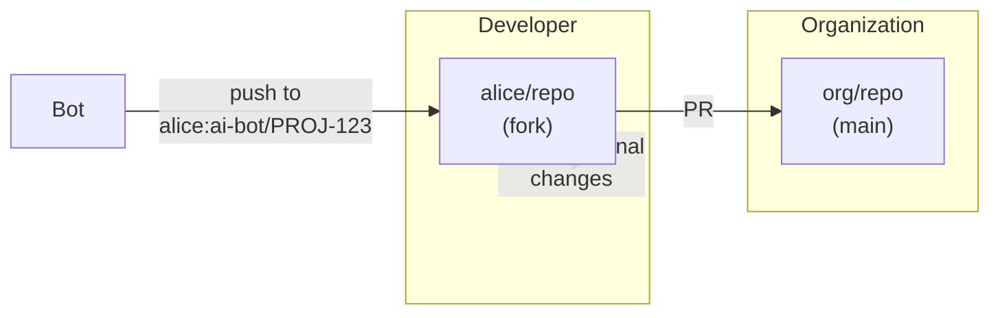
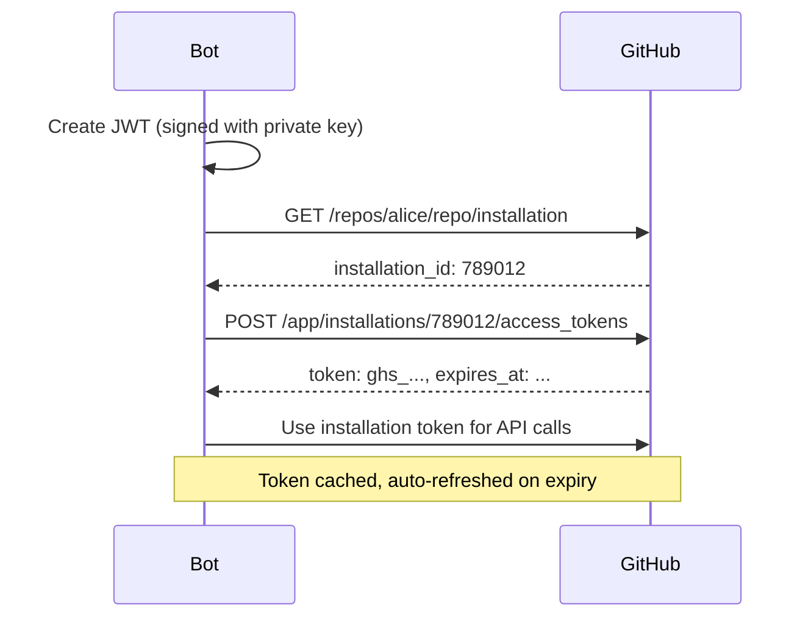
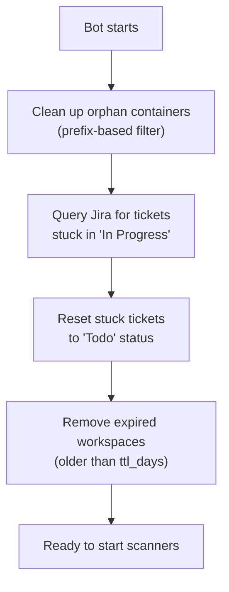

# Architecture

This document describes how the Jira AI Issue Solver works: its components,
data flow, container strategy, workspace lifecycle, security model, and
operational concerns.

For configuring target repositories, see [repo-configuration.md](repo-configuration.md).
For GitHub App setup, see [admin-setup.md](admin-setup.md).

## Overview

The Jira AI Issue Solver watches for Jira tickets, runs AI agents inside
ephemeral containers against cloned repositories, and creates GitHub pull
requests with the results. It handles the full lifecycle: ticket discovery,
workspace management, container orchestration, PR creation, and review
feedback processing.



**Design principles:**

- **Bot manages plumbing, AI acts autonomously.** The bot decides *what*
  needs doing. The AI decides *how*.
- **The container is the sandbox.** The AI runs with full permissions inside
  an ephemeral container. The container provides safety isolation.
- **The environment is the interface.** The bot communicates with the AI
  through the filesystem: the repo, a task file, and the container's
  toolchain. No prompt templates.
- **Teams own their environments.** Teams provide container images with
  their toolchain and AI CLI. The bot doesn't inject tools.
- **Jira and GitHub are the state store.** No database. Ticket status = job
  state. PR existence = completion proof. Crash recovery queries Jira.

## Component Architecture



### Package Responsibilities

| Package | Purpose |
|---------|---------|
| `scanner/` | Polls Jira for new tickets and GitHub for review comments. Stateless — derives "addressed" state from bot replies. |
| `jobmanager/` | Concurrency control, per-ticket retry tracking, circuit breaker, cost budget enforcement. |
| `executor/` | Orchestrates the full job lifecycle: workspace setup, container launch, AI execution, commit, PR creation, status transitions. |
| `tracker/` | `IssueTracker` interface for work item operations. `jira/` sub-package adapts `JiraService`. |
| `workspace/` | Per-ticket workspace lifecycle: clone, branch, TTL-based cleanup, self-healing re-clone. |
| `container/` | Container runtime detection, image resolution from repo config, container lifecycle with resource limits. |
| `taskfile/` | Generates markdown task files. Appends universal instructions (all tasks) and workflow (new tickets only) from repo files or project-config fallback. |
| `projectresolver/` | Maps ticket keys to project settings (component-to-repo, status transitions, imports). |
| `costtracker/` | Tracks daily AI session costs with file-based persistence and budget enforcement. |
| `commentfilter/` | Shared bot-loop prevention: ignored users, known bots, thread depth limits. |
| `recovery/` | Startup crash recovery: orphan container cleanup, stuck ticket reset, workspace TTL enforcement. |
| `repoconfig/` | Parses `.ai-bot/config.yaml` from target repositories for per-repo settings (PR, AI, imports). |
| `services/` | Infrastructure clients: `JiraService` (REST API), `GitHubService` (App auth, Git Data API, fork management). |
| `models/` | Configuration (`Config`), Jira API types, domain types (`WorkItem`, `SearchCriteria`, `ProjectSettings`). |

### Consumer-Defined Interfaces

Each package declares only the methods it needs from its dependencies,
following Go's interface convention. There are no shared interface packages.
The underlying implementation (`*GitHubServiceImpl`, `*JiraServiceImpl`)
satisfies all consumers without any of them knowing the full API surface.



## Workflow: New Ticket



## Workflow: PR Feedback



## Container Strategy

AI agents run inside ephemeral containers with the target repository
mounted. The container provides:

- The project's toolchain (compiler, linter, test framework)
- The AI CLI (`claude`, `gemini`, etc.)
- Network access to the AI API endpoint

The container does **not** receive GitHub tokens, Jira credentials, or
host filesystem access. The bot commits via the GitHub API after the
AI finishes.

### Configuration Resolution



Only the highest-priority repo-level source is used — sources 1 and 2 do
not stack. Within the selected source, unset fields fall through to
bot-level defaults. See [repo-configuration.md](repo-configuration.md) for
file formats and examples.

### Security Boundary

| Resource | AI has access? | How |
|----------|---------------|-----|
| Source code | Yes | Mounted at `/workspace` |
| Project toolchain | Yes | Installed in container image |
| AI API (Anthropic/Google) | Yes | API key in env var |
| GitHub API | No | No token in container |
| Jira API | No | No credentials in container |
| Host filesystem | No | Container isolation |
| Other containers | No | Container isolation |

The AI runs with full permissions inside the container because the
container **is** the permission boundary.

## Workspace Lifecycle

Workspaces are scoped to **tickets**, not jobs. A workspace directory
persists across all jobs for the same ticket, enabling AI-generated
artifacts to survive between sessions.



### What survives between jobs

| Content | Survives? | Why |
|---------|-----------|-----|
| Committed source files | Yes | `git reset --hard` updates to match remote |
| Human developer commits | Yes | `git fetch` pulls before reset |
| Untracked artifacts (caches, indexes) | Yes | `git reset --hard` ignores untracked files |
| Uncommitted modifications | No | Already committed via API, reset discards local copy |
| Container filesystem | No | Container destroyed after each job |

### Cleanup triggers

- **TTL expiry**: Workspaces older than `workspaces.ttl_days` are removed
  at startup, regardless of ticket status.
- **Startup cleanup**: `StartupRunner` scans for orphaned workspaces on
  boot and removes those for tickets no longer in active states.

## Fork-Based Workflow

The bot pushes code to the **developer's fork**, enabling true
collaboration. Both bot and developer can push to the same branch.



**Process:**

1. Jira ticket assigned to Alice (`alice@company.com`)
2. Bot maps `alice@company.com` to GitHub username `alice`
3. Bot clones Alice's fork, creates branch `ai-bot/PROJ-123`
4. AI generates changes inside container
5. Bot commits via GitHub API (verified commits)
6. Bot creates PR from `alice:ai-bot/PROJ-123` to `org:main`
7. Alice can push additional changes to the same branch

## GitHub App Authentication

The bot uses a GitHub App for authentication:

- **Fine-grained permissions**: Only Contents and Pull Requests (read/write)
- **Short-lived tokens**: Installation tokens expire after 1 hour, auto-refreshed
- **Per-installation scope**: Different token for each repository
- **Clear audit trail**: Actions attributed to `app-name[bot]`



## Crash Recovery

On startup, `StartupRunner` recovers from prior crashes:



No database is needed. Jira ticket status and GitHub PR existence are the
durable state. The filesystem (workspace directories and container names)
is discoverable by naming convention.

## Bot-Loop Prevention

The feedback scanner filters comments to prevent infinite bot-to-bot
conversations:

| Mechanism | Config key | Behavior |
|-----------|-----------|----------|
| Ignored users | `github.ignored_usernames` | Comments completely skipped (for CI bots like packit) |
| Known bots | `github.known_bot_usernames` | Processed initially, but loop prevention stops reply chains |
| Thread depth | `github.max_thread_depth` | Maximum bot replies per conversation thread (default: 5) |

## Guardrails

Safety mechanisms to prevent runaway costs and cascading failures:

| Guardrail | Config key | Description |
|-----------|-----------|-------------|
| Concurrency limit | `guardrails.max_concurrent_jobs` | Maximum parallel jobs |
| Retry limit | `guardrails.max_retries` | Per-ticket failure limit before rejection |
| Daily cost budget | `guardrails.max_daily_cost_usd` | Pauses job creation when exceeded |
| Container timeout | `guardrails.max_container_runtime_minutes` | Kills containers exceeding this duration |
| Circuit breaker | `guardrails.circuit_breaker_threshold` | Pauses all jobs after N consecutive failures |

## Configuration

The bot uses a multi-project configuration model. Each project can have its
own status transitions, component-to-repo mappings, and PR field settings.

See:
- [`config.example.yaml`](../config.example.yaml) for the complete
  bot-level configuration reference
- [`docs/repo-configuration.md`](repo-configuration.md) for per-repository
  `.ai-bot/` configuration

## Troubleshooting

### "GitHub App is not installed on {owner}/{repo}"

The app isn't installed on the target repository.

1. **Main repo**: Admin installs the app (see [admin-setup.md](admin-setup.md))
2. **Developer fork**: Developer installs the app (see [contributor-setup.md](contributor-setup.md))
3. Verify: `https://github.com/{owner}/{repo}/settings/installations`

### "failed to get installation ID"

App ID or private key is incorrect.

1. Verify `github.app_id` matches the app ID from GitHub
2. Verify `github.bot_username` matches the app name (without `[bot]` suffix)
3. Check private key file exists, is readable, and hasn't been revoked

### "404 Not Found" when pushing

Fork doesn't exist or username mapping is wrong.

1. Verify the fork exists: `https://github.com/{username}/{repo}`
2. Check `jira.assignee_to_github_username` mapping in config
3. Ensure the repository is actually a fork (not a separate repo)

### Bot responds to other bots infinitely

Add bot usernames to config (without `[bot]` suffix):

```yaml
github:
  known_bot_usernames:
    - "github-actions"
    - "coderabbitai"
```

### AI generates no changes

1. Check ticket description is clear and actionable
2. Check container logs for AI errors or timeouts
3. Verify container resource limits are sufficient
4. The coordinator retries failed jobs up to `guardrails.max_retries` times

### Rate limiting

GitHub App rate limits: 5,000 requests/hour per installation. Increase
`jira.interval_seconds` to reduce polling frequency.

## Related Documentation

- **[Repository Configuration](repo-configuration.md)** — Configuring target repos
- **[Admin Setup](admin-setup.md)** — Creating the GitHub App
- **[Contributor Setup](contributor-setup.md)** — Developer fork setup
- **[Testing Setup](testing-setup.md)** — Deploying and testing the bot
- **[Debugging Guide](debugging.md)** — Debugging the application
